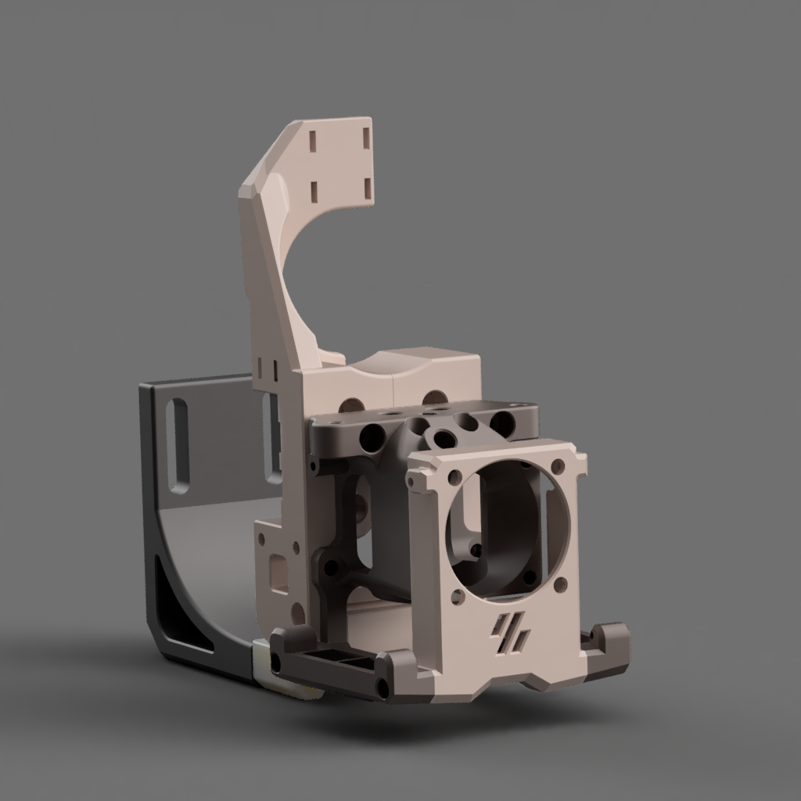
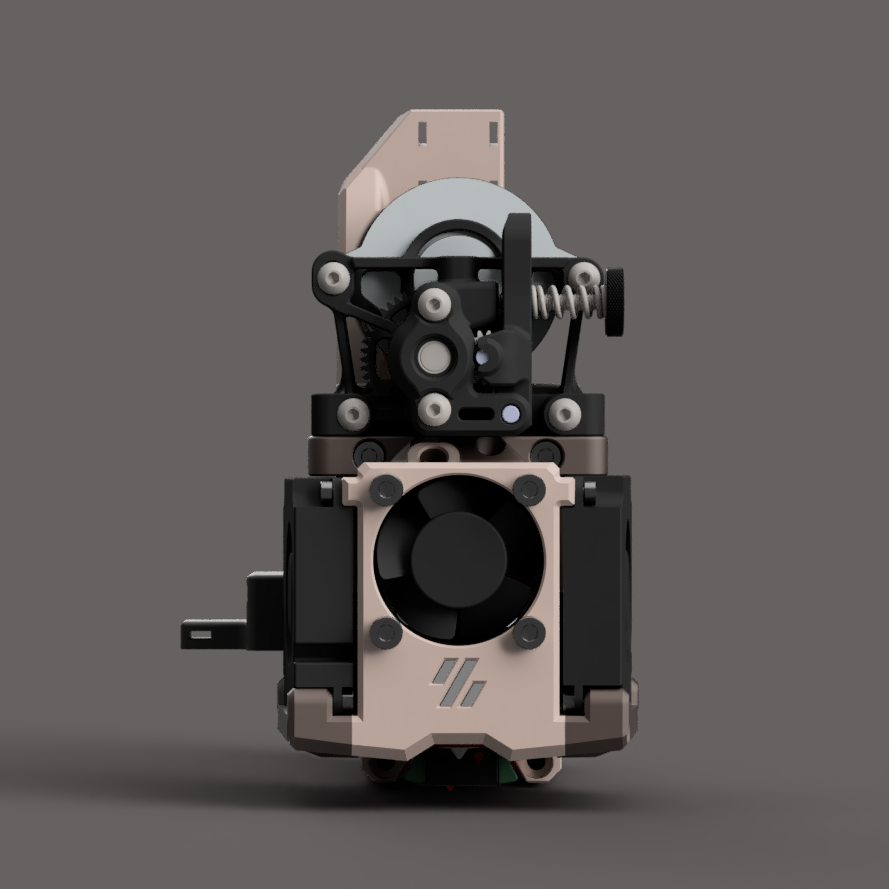

# Smol Mantis Toolhead

dual 4010 toolhead with Stealthburner style leds for dragon hotend/sherpa mini.

 

### Features
* Split mgn12 carriage to faciliate belt installation
* mgn12 carriage has integrated umbilical/zipchain anchor
* integrated klickyNG carriage for both mgn9 and mgn12
* SB leds support 
* Removable 4010 fan ducts with large outlets. Should be easy to design and make ducts improvements

### Compatibility
* Toolhead has the same mounting pattern as the stock mantis, and should work with other mantis carriage variants for other probe needs
* KlickyNG is not compatible with original Klicky probes. KlickyNG/unklickyNG probes are much easier to build.
* Dragon SF/HF hotend
* Homemade or bought sherpa mini extruder

### BOM
* A bunch of m2x8 and m2x10 self-tapping screws
* Various m3 screws
* heatset m3, 5mm diameter, 4mm tall
* 2x 4010 fans. Delta BFB0412HHA-A or BFB0405HHA-A are recommended
* 1x 3010 fan. Sunon MF30101V1-1000U-A99 
* Sherpa mini extruder. [optional front brace](https://github.com/Annex-Engineering/Annex-Engineering_User_Mods/tree/main/Extruders/Sherpa_Mini/Extruder_Mods/Long-housing_front_angled_front_brace)
* klickyNG probe

### Credits
* 4010 fan shroud was based on [Minsket's](https://github.com/Minsekt/moronvods/tree/main/Dual_4010_SB_LEDS), but the fan duct has been redesigned for airflow/rigidity/upgradability
* [Long's mantis toolhead](https://github.com/mandryd/VoronUsers/tree/master/printer_mods/Long/Mantis_Dual_5015)
* [Annex Engineering Sherpa Mini extruder](https://github.com/Annex-Engineering/Sherpa_Mini-Extruder)
* [KlickyProbe](https://github.com/jlas1/Klicky-Probe)

### Similar designs

* [Mantis Xol](https://github.com/CorvidBuilds/Mantis-Xol): Double folded ascender/dual 4010/rapido
* [DirtyBird toolhead](https://github.com/makerbogans/dirtybird) LGX mini/sherpa/dual 4512/Dragon/NF crazy/Rapido